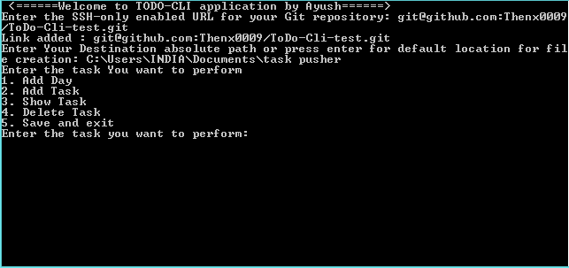

# Git Task Pusher CLI Application 

ScreenShots




## Check out the App here 
   [.exe File](https://github.com/Thenx0009/task_pusher/blob/master/dist/todo.exe)
## Overview

Welcome to the Git Task Pusher CLI application by Sharpsailor ([AYUSH VERMA](https://www.linkedin.com/in/ayush-verma-33a260255/))! This command-line tool simplifies task management by providing a convenient interface to organize daily tasks and push them to a GitHub repository.

## Features

- **Task Management:** Add, view, and delete tasks for each day.
- **GitHub Integration:** Push tasks to a GitHub repository for version control.
- **Customizable Destination:** Choose a destination folder for task files.

## Installation

To use the TODO-CLI application, follow these steps:

1. **Clone the Repository:**
   ```
   git clone https://github.com/your-username/todo-cli.git
   cd todo-cli
    ```
2. **Run the Application:**
    
    ```
    python todo_cli.py

    ```
    

## Usage

### Adding a Day
1. Run the application.
2. Select the option to add a new day.
3. Enter the day number.
4. Add tasks for the day.

### Adding a Task
1. Run the application.
2. Select the option to add a task.
3. Enter the task details.

### Viewing Tasks
1. Run the application.
2. Select the option to view tasks.

### Deleting a Task
1. Run the application.
2. Select the option to delete a task.
3. Enter the task number to delete it.

### Saving and Exiting
1. Run the application.
2. Select the option to save and exit.

## GitHub Integration

Ensure your GitHub credentials are configured within the application for seamless integration. Upon exiting the application, choose whether to push tasks to your GitHub repository.

## Contributing

Contributions are welcome! Feel free to submit issues or pull requests.

